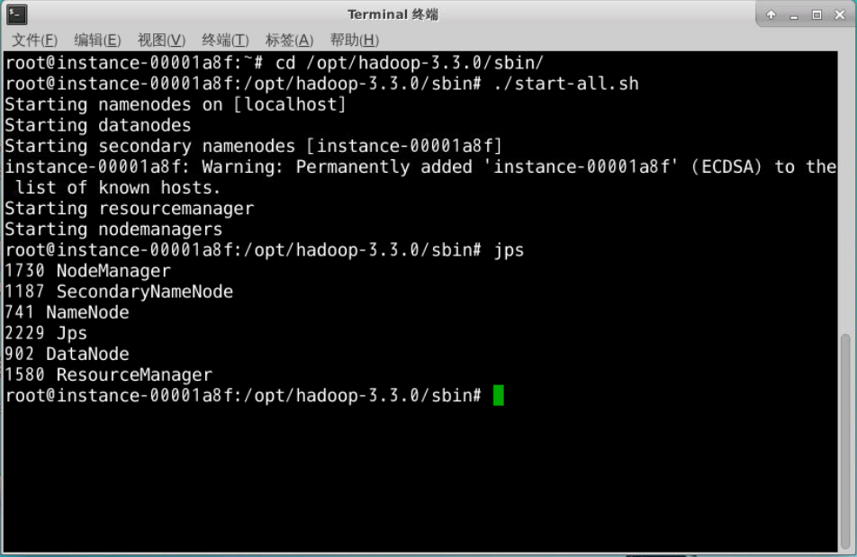
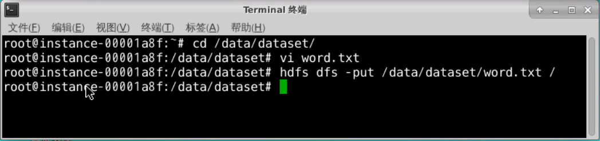
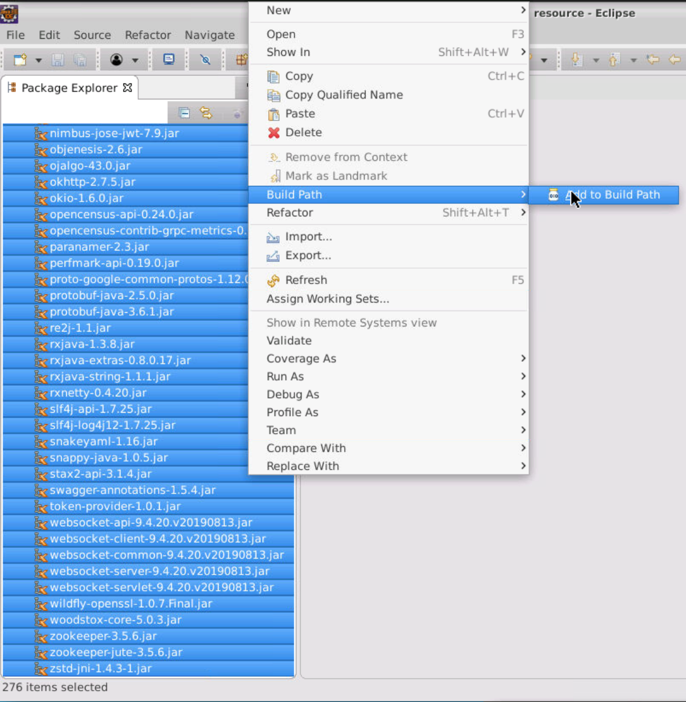
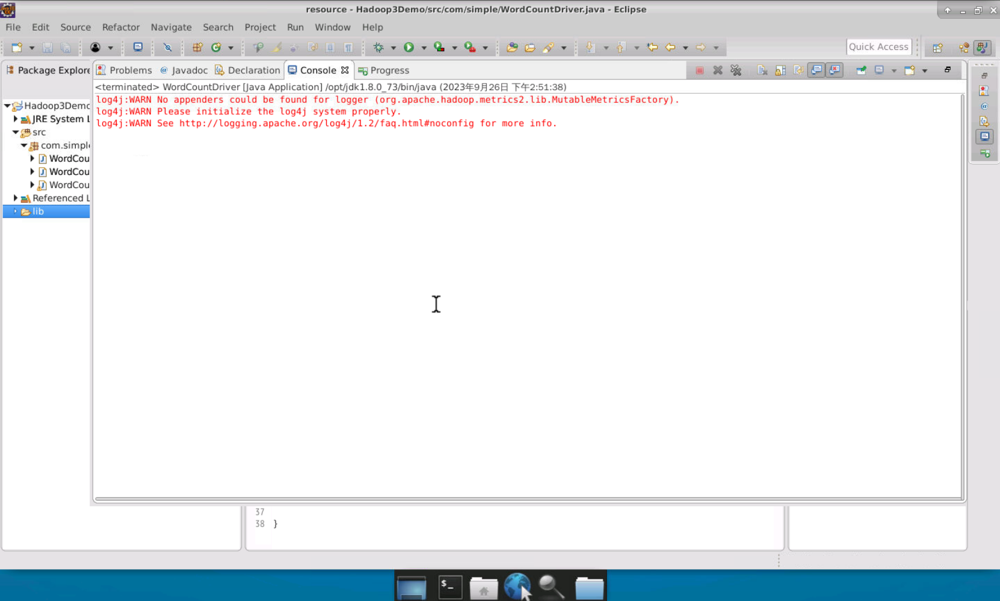
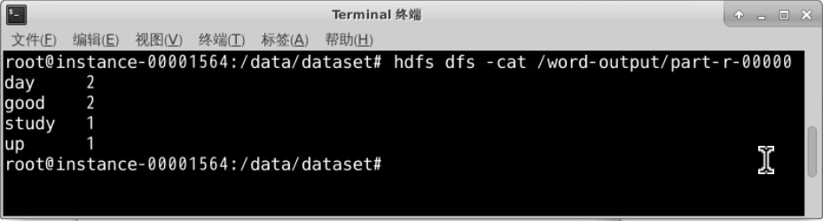

#### 启动Hadoop集群

执行如下命令，启动HDFS集群。

```shell
$ cd /opt/hadoop-3.3.0/sbin/	# 移动到程序目录
$ ./start-all.sh				# 启动脚本
$ jps							# 查看HDFS服务启动情况
```



#### 准备数据文件

  1、编辑数据文件"word.txt":

```shell
$ cd /data/dataset/
$ vi word.txt
```

  在"word.txt"文件中，输入如下内容，单词间以空格分隔：

```
good good study
day day up
```

  2、将数据文件"word.txt"上传至HDFS的根目录下。

```shell
$ hdfs dfs -put /data/dataset/word.txt /
```



#### 创建Map/Reduce项目

1. 启动 Eclipse 开发工具。
2. 打开 Eclipse 后，依次选择菜单栏中的【File】->【New】->【Project】->【Java project】，创建一个名为【Hadoop3Demo】的 Java 项目，然后点击【Finish】按钮完成创建。
3. 创建一个名为【lib】的文件夹，并将从指定位置（/data/software/hadoop3_lib/）获取的 Hadoop 相关的 JAR 包放入该文件夹中。
4. 将 lib 文件夹下的所有 JAR 包导入到项目的环境变量中，方法是在 lib 文件夹上右键单击，选择【build path】->【add to build path】。此后，你会在项目中看到一个名为【Referenced Libraries】的列表项。




#### 编写MapReduce程序，统计"word.txt"文本中的单词出现频率

  1、创建名为”com.simple.WordCountMapper”的Java类.

示例代码是一个简单的Hadoop MapReduce程序的Mapper部分，用于读取文本数据，完成对单词的切分处理,并以（k,v）的形式输出到Reduce阶段，以便Reducer阶段进一步计算每个单词的出现次数。

编辑源代码如下：

```java
package com.simple;
import java.io.IOException;
import java.util.StringTokenizer;
import org.apache.hadoop.io.IntWritable;
import org.apache.hadoop.io.LongWritable;
import org.apache.hadoop.io.Text;
import org.apache.hadoop.mapreduce.Mapper;	// 定义代码所在的包并导入所需的类

public class WordCountMapper extends Mapper<LongWritable, Text, Text, IntWritable> {
		// 继承了Hadoop MapReduce框架中的Mapper类
    	// 定义了两个私有成员变量
		private final IntWritable one = new IntWritable(1);
    	// 变量one是类型为IntWritable的常量，值为1，用于表示一个单词的计数。
		private Text word = new Text();
    	// 变量word是类型为Text的变量，用于存储从输入文本中解析出来的单词。	
　　
		@Override
		public void map(LongWritable key, Text value, Context context) 
								throws IOException, InterruptedException {
            // 每次调用都会传入一个键值对，其中key是行的偏移量，value是实际的文本行内容。
			String line = value.toString();	// 将输入的Text类型值转换为Java的String类型
			StringTokenizer token = new StringTokenizer(line);	//使用将文本分割为多个单词
			while (token.hasMoreTokens()) {
				word.set(token.nextToken());	// 将单词设置为word变量的值
				context.write(word, one);		// 与常量one一起作为键值对写入context
			}
		}
	}
```

  2、编写WordCountReducer类代码，实现对单词个数的统计。
创建名为”com.simple.WordCountReducer”的Java类。

示例代码是一个简单的Hadoop MapReduce程序的Reducer部分，它从Mapper接收单词和计数，对相同的单词进行计数累加，然后输出每个单词的总计数。

编辑源代码如下：

```java
package com.simple;
import java.io.IOException;
import java.util.Iterator;
import org.apache.hadoop.io.IntWritable;
import org.apache.hadoop.io.Text;
import org.apache.hadoop.mapreduce.Reducer;	// 定义代码所在的包并导入所需的类

public class WordCountReducer extends Reducer<Text, IntWritable, Text, IntWritable> {

		@Override
		public void reduce(Text key, Iterable<IntWritable> values, Context context)
							throws IOException, InterruptedException {
			int sum = 0;
			for (IntWritable val : values) {	// 遍历values
				sum += val.get();	// 将每个计数加到sum变量中，从而得到该单词的总计数
			}
			context.write(key, new IntWritable(sum));
            // 将单词及其总计数写入上下文，作为输出。
		}
}
```

  3、创建驱动程序类WordCountDriver，提交和运行作业。
创建名为"com.simple.WordCountDriver"的Java类。

示例代码的主要作用是配置和启动Word Count job。它首先创建并配置了一个MapReduce作业，设定了作业的名称、Mapper类、Reducer类、输出键值对类型，以及输入输出的路径。接着，它提交这个作业并等待其执行完成。整个Word Count程序旨在统计给定文本文件中每个单词的出现次数，并将结果存储在Hadoop文件系统（HDFS）的指定位置。

编辑源代码如下：

```java
package com.simple;
import org.apache.hadoop.conf.Configuration;
import org.apache.hadoop.examples.WordCount.TokenizerMapper;
import org.apache.hadoop.fs.Path;
import org.apache.hadoop.io.IntWritable;
import org.apache.hadoop.io.Text;
import org.apache.hadoop.mapreduce.Job;
import org.apache.hadoop.mapreduce.lib.input.FileInputFormat;
import org.apache.hadoop.mapreduce.lib.output.FileOutputFormat;
import org.apache.hadoop.mapreduce.lib.reduce.IntSumReducer;

public class WordCountDriver {
	// 定义了main方法，作为程序的入口点。
	public static void main(String[] args) throws Exception {
	    final String hdfsurl = "hdfs://localhost:9000";	// 设置了Hadoop文件系统的URL。
		// 组织一个job，并提交
		Configuration conf = new Configuration();	// 创建了Hadoop的Configuration对象。
	    Job job = Job.getInstance(conf, "word count");
		// 使用配置对象初始化了一个名为"word count"的Job实例。
	    job.setJarByClass(WordCountDriver.class);
		// 通过setJarByClass方法，设置了jar包的位置，通常是包含Driver类的jar包。
	    job.setMapperClass(TokenizerMapper.class);
		job.setCombinerClass(IntSumReducer.class);
	    job.setReducerClass(IntSumReducer.class);
		// 设置了作业输出键值对的类型。
        
	    // 如果map输出的中间结果类型，与reduce输出的结果类型相同时，可省略map的输出类型设置
	    job.setOutputKeyClass(Text.class);
	    job.setOutputValueClass(IntWritable.class);
	    // 指定要处理的输入数据文件的路径，执行时传入的第一个参数指定
	    FileInputFormat.addInputPath(job, new Path(hdfsurl+"/word.txt"));
	    // 指定最后reducer输出结果保存的文件路径，执行时传入的第二个参数指定
	    FileOutputFormat.setOutputPath(job, new Path(hdfsurl+"/word-output"));    
	    boolean flag = job.waitForCompletion(false);
        // 等待作业执行完毕，参数false表示不在客户端显示详细的进度信息
	    System.exit(flag?0:1);
        // 如果作业成功完成，则退出代码为0，否则为1。
	}

}
```

#### 程序测试及运行

  1、运行程序。



  2、如果一切正常，则可以在HDFS上查看统计的结果文件。在终端窗口中，执行如下命令：

```shell
$ hdfs dfs -cat /word-output/part-r-00000
```

  可以看到单词计数的结果如下：


