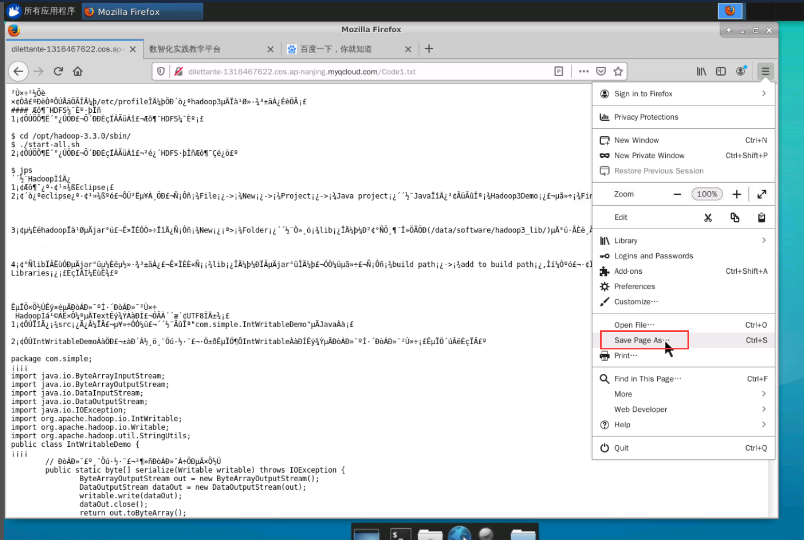

有三种方法可以直接复制粘贴代码从而偷懒：

1. 上传文件

   先将代码复制到txt文件中，上传到虚拟机中。
   
   不过我用不了，不清楚你们能不能用。
   

2. 选中粘贴
   先将文字、代码复制到剪切板中，再粘贴到虚拟机中。

   这个方法缺陷很大，会吞汉字和换行。
   

3. 利用我上传的文件
   虚拟机中打开浏览器，然后打开链接 [10.10.244.11](http://10.10.244.11/) ，登录校园网就可以连接外网了。
   再在浏览器中输入下面的链接即可打开我上传好的代码。
   
   如果有乱码的话，将页面保存下来，再用系统自带的文本编辑软件打开，就没有乱码了。

短链接转跳		http://mrw.so/5EQtVe

序列化_Writable接口	https://dilettante-1316467622.cos.ap-nanjing.myqcloud.com/Code1.txt

序列化_Writable类	https://dilettante-1316467622.cos.ap-nanjing.myqcloud.com/Code2.txt

序列化_自定义Writable类	https://dilettante-1316467622.cos.ap-nanjing.myqcloud.com/Code3.txt

读写SequenceFile文件	https://dilettante-1316467622.cos.ap-nanjing.myqcloud.com/Code4.txt

一边做题一边更新。
